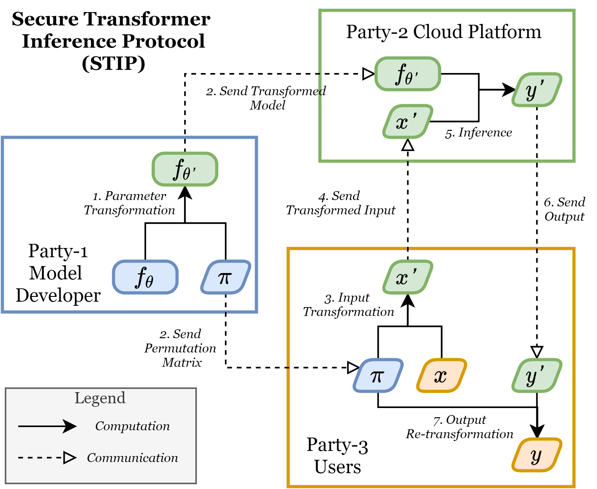

# Secure Transformer Inference

Secure Transformer Inference Protocol, STIP, is a three-party protocol that can protect both Transformer parameters and user data during the inference phase. 
For each feedforward inference process, STIP only introduces permutation computation of input and output data on the user side. 
STIP can be applied to real-world services like ChatGPT.

The figure below show the overview of STIP.

We consider three parties:

* Party-1 ($P_1$): Model developer (e.g., OpenAI) that owns the original Transformer model $f_\theta$.
* Party-2 ($P_2$): Cloud computing platform (e.g., Azure) that owns the computing hardware.
* Party-3 ($P_3$): Users that own private input (e.g., prompt token embedding) and output (e.g., response token logits).

Initialization phase:
* $P_1$ randomly generate $\pi \in \mathbb{R}^{d\times d}$\;
* $P_1$ transform $f_\theta$ to $f_{\theta'}$ using $\pi$\;
* $P_1$ send $f_{\theta'}$ to $P_2$ and send $\pi$ to $P_3$\;

Inference phase:
* $P_3$ transform $x$ to $x'=x\pi$ and send $x'$ to $P_2$\;
* $P_2$ compute $f_{\theta'}(x')=y'$ and send $y'$ to $P_3$\;
* $P_3$ de-transform $y'$ by computing $y'\pi^T$ and get $y\pi\pi^T=y$.

For detailed transformation of model parameters, please refer to [our paper](./arXiv2023_Secure_Transformer_Inference.pdf). 

## License

Secure Transformer Inference Protocol (STIP) is licensed under the [MIT License](./LICENSE).